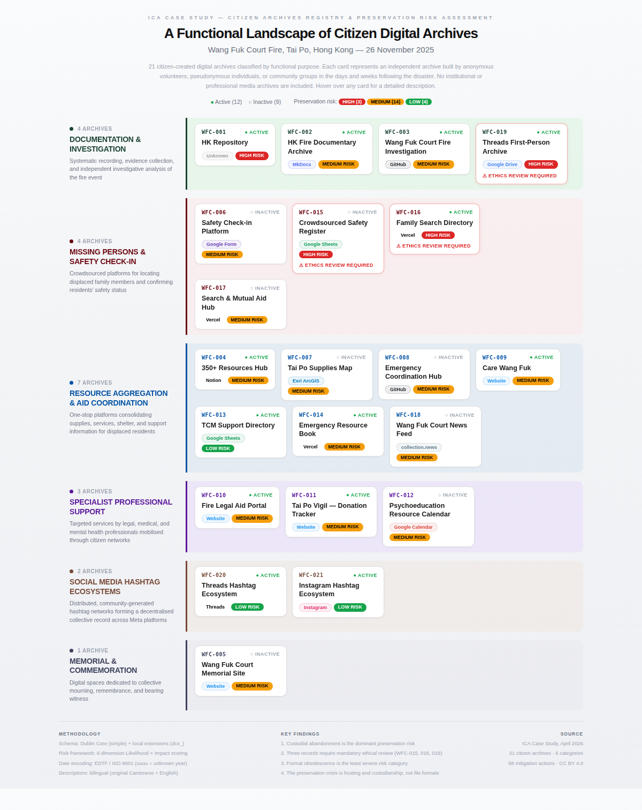

# Tai Po Wang Fuk Court Citizen Archive — Registry & Preservation Risk Assessment

A structured registry and preservation risk assessment of **21 citizen-led digital archives** documenting the **Wang Fuk Court fire (Tai Po, Hong Kong, 26 November 2025)**.

Prepared as a case study for the **International Council on Archives (ICA)** — International Archives Week 2026 — on distributed, volunteer-maintained crisis archives.

---

## Quick access

| What you are looking for | Where to go |
|---|---|
| **Visual overview** | [`poster.png`](poster.png) — or browse the [trilingual visual guide](#visual-guide-multilingual) below |
| **Cleaned registry** | [`data/registry.xlsx`](data/registry.xlsx) · [CSV](data/registry.csv) · [JSON](data/registry.json) |
| **Risk assessment** | [`risk_assessment/risk_assessment.xlsx`](risk_assessment/risk_assessment.xlsx) |
| **Methodology** | [`docs/methodology.md`](docs/methodology.md) |
| **Ethical framework** | [`docs/ethics.md`](docs/ethics.md) |
| **How to cite** | [`CITATION.cff`](CITATION.cff) |

---

## What is this?

In the weeks following the Wang Fuk Court fire, Hong Kong citizens created dozens of ad-hoc digital archives: Google Sheets for missing-persons check-in, GitHub repositories for independent fire-dynamics investigation, Notion pages aggregating aid resources, Threads and Instagram hashtag ecosystems, Vercel-hosted mutual aid apps, and memorial websites. These archives are:

- **Distributed** — no single custodian
- **Anonymous or pseudonymous** — most curators chose not to disclose identity
- **Technically fragile** — hosted on free-tier platforms, custom domains, or ephemeral services
- **Ethically complex** — some contain missing-persons data or first-hand victim accounts
- **Politically sensitive** — documenting a contested event in post-2025 Hong Kong

This repository provides a **cleaned metadata registry** of 21 such archives, a **preservation risk assessment** across six risk dimensions, and a **reusable methodology** grounded in the post-custodial archival framework. The scope is limited to **citizen-created archives only**; institutional media (e.g., CNA documentary) and open-infrastructure repositories (e.g., Wikimedia Commons) are excluded.

---

## Visual guide (multilingual)

A functional classification of all 21 archives across six categories — documentation, missing persons, resource aggregation, specialist support, social media ecosystems, and memorial. Hover over any card in the HTML version for detailed descriptions.

| Language | Interactive (HTML) | Static preview (PNG) |
|---|---|---|
| English | [poster.html](poster.html) | [poster.png](poster.png) |
| Français | [poster_fr.html](poster_fr.html) | [poster_fr.png](poster_fr.png) |
| 繁體中文 | [poster_zh.html](poster_zh.html) | [poster_zh.png](poster_zh.png) |



---

## Repository contents

```
.
├── README.md                      You are here
├── LICENSE                        CC BY 4.0 (metadata) + MIT (code)
├── CITATION.cff                   How to cite this work
├── CHANGELOG.md                   Version history
│
├── poster.html                    Interactive visual guide (English)
├── poster.png                     Static preview (English)
├── poster_fr.html / .png          Visual guide (French)
├── poster_zh.html / .png          Visual guide (Traditional Chinese)
│
├── data/                          The cleaned registry
│   ├── registry.xlsx              Full workbook (registry + vocab + cleaning log)
│   ├── registry.csv               Flat CSV export (bilingual descriptions)
│   ├── registry.json              JSON export (bilingual descriptions)
│   ├── vocab_dc_type.csv          Controlled vocabulary: DCMI Type
│   ├── vocab_status.csv           Controlled vocabulary: status
│   ├── vocab_date_certainty.csv   Controlled vocabulary: date certainty
│   ├── vocab_anonymity.csv        Controlled vocabulary: creator anonymity
│   └── hashtags.csv               Individual hashtags aggregated in WFC-020/021
│
├── risk_assessment/               Preservation risk assessment
│   ├── risk_assessment.xlsx       Full workbook (framework + scoring + mitigation)
│   ├── scoring_matrix.csv         Per-record scores on 6 risk dimensions
│   └── mitigation_actions.csv     Action plan per record
│
├── docs/                          Methodology and rationale
│   ├── methodology.md             How the study was conducted
│   ├── schema.md                  Dublin Core application profile
│   ├── cleaning_log.md            Data cleaning audit trail
│   └── ethics.md                  Ethical framework and decisions
│
└── scripts/
    └── validate.py                Integrity check script
```

---

## Quick statistics

| | |
|---|---|
| Records in registry | 21 (citizen archives only) |
| Excluded | Institutional media (CNA documentary) and open-infrastructure repositories (Wikimedia Commons) |
| Metadata schema | Dublin Core (simple) + `dcx_` extensions |
| Date format | EDTF / ISO 8601 (`uuuu` = unknown year) |
| Descriptions | Bilingual: original language + [EN] English translation |
| Risk assessment dimensions | 6 (R1–R6) |
| Mitigation actions | 58 across 6 priority levels |
| High-risk records requiring urgent action | 3 |
| Records requiring ethical review before preservation | 3 |
| Visual guide languages | English, French, Traditional Chinese |

---

## Risk summary

Full assessment in `risk_assessment/`. The six risk dimensions are:

| Code | Risk category |
|---|---|
| R1 | Link rot / URL decay |
| R2 | Platform dependency |
| R3 | Custodial abandonment |
| R4 | Format obsolescence |
| R5 | Legal / political risk |
| R6 | Ethical / privacy risk |

**Top-line findings:**

1. **Custodial abandonment (R3) is the dominant risk pattern** — citizen archives built by anonymous volunteers lack institutional handoff mechanisms. This is the structural signature of participatory, community-led archival practice.
2. **Three records** (WFC-015, WFC-016, WFC-019) **require ethical review** before any technical preservation action; they contain missing-persons data or aggregated victim accounts. Archival aggregation of individually public content can create new, unconsented exposure for vulnerable subjects.
3. **Format obsolescence (R4) is the least severe category** — contradicting the traditional digital preservation emphasis on formats. The real preservation crisis is hosting and custodianship, not file formats.
4. **Open-infrastructure migration pathways** (GitHub forks, Software Heritage crawls, Zenodo deposits, Internet Archive snapshots) offer realistic preservation routes that respect community ownership. Institutional actors can identify these pathways *without* claiming custodial control.
5. **Legal / political risk has an elevated baseline** across the entire registry; no record is politically neutral in the post-2025 Hong Kong context.

---

## How to use this repository

**As an ICA case study reference:**
Read [`docs/methodology.md`](docs/methodology.md) first, then browse [`data/registry.xlsx`](data/registry.xlsx) and [`risk_assessment/risk_assessment.xlsx`](risk_assessment/risk_assessment.xlsx).

**For data reuse:**
The CSV and JSON exports in `data/` are licensed CC BY 4.0. Schema documentation is in [`docs/schema.md`](docs/schema.md). Cite using [`CITATION.cff`](CITATION.cff).

**To adapt the methodology for another crisis archive:**
The framework in `risk_assessment/risk_assessment.xlsx` → `framework` sheet is reusable. [`docs/methodology.md`](docs/methodology.md) describes the workflow step by step. The six risk dimensions, scoring rubric, and mitigation action taxonomy are event-independent.

**To verify data integrity:**
Run `python scripts/validate.py` from the repository root. Nine automated checks confirm record count, identifier uniqueness, controlled vocabulary adherence, EDTF date conformance, and cross-reference consistency between registry, scoring matrix, and mitigation actions.

---

## Theoretical framework

This project applies the **post-custodial archival framework** (Cook, 2013; Flinn, 2007) to a distributed, anonymous, crisis-driven documentation ecosystem. The guiding principle: information professionals do not become custodians, but collaborators who identify preservation pathways that communities can adopt, modify, or refuse. Technical expertise is offered, not imposed.

The methodological innovation is the integration of **ethical risk as a first-class preservation dimension** alongside technical risks (link rot, platform dependency, custodial abandonment, format obsolescence, legal/political risk). Ethical flags trigger concrete workflow consequences — metadata-only preservation, dark archive deposit, access embargoes, or mandatory community review — rather than being treated as a separate governance layer.

---

## Ethical commitments

This project follows principles from the **SAA Core Values Statement** (Society of American Archivists), the **Protocols for Native American Archival Materials** (adapted for crisis-affected communities), and the **IFLA Statement on Privacy in the Library Environment**.

Specific commitments:

- **No creator de-anonymisation.** Anonymous curators remain anonymous in this registry. Pseudonymous handles are retained only where the curator had already publicly self-disclosed on their own platform.
- **Ethical risk is a first-class preservation risk.** Missing-persons data and aggregated victim accounts trigger mandatory ethical review before any technical capture.
- **Aggregation harm is recognised.** Individually public posts, when collected and archived together, create new exposure not consented to at the moment of posting.
- **No data was scraped or mirrored in producing this assessment.** Only metadata describing the resources was collected.
- **Shared stewardship, not custodial capture.** This project describes and assesses preservation risk; it does not itself preserve. The archives belong to the citizens of Tai Po who built them.

See [`docs/ethics.md`](docs/ethics.md) for full discussion.

---

## Citation

If you use this registry or methodology, please cite using [`CITATION.cff`](CITATION.cff). Short form:

> NG Wing Lam. 2026. *Tai Po Wang Fuk Court Citizen Archive Registry and Preservation Risk Assessment.* ICA Case Study. https://github.com/toxicguu/tai-po-citizen-archive

---

## Licence

- **Metadata and documentation** (registry, risk assessment, docs, visual guides): [CC BY 4.0](https://creativecommons.org/licenses/by/4.0/)
- **Code** (scripts/): [MIT](https://opensource.org/licenses/MIT)

See [`LICENSE`](LICENSE) for full text.

---

## Acknowledgements

To the citizen archivists of Tai Po, Hong Kong, who built these resources in the days after the fire. This registry exists to help ensure their work is not lost.

---

*Prepared for the International Council on Archives · International Archives Week 2026 · #ArchivesForJustice*
